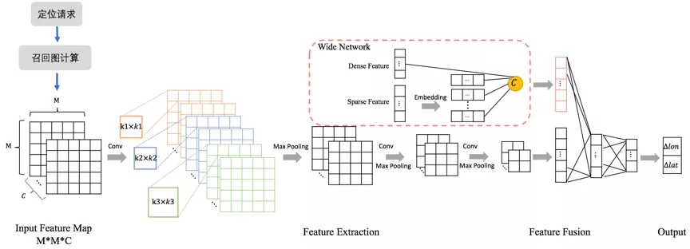

# 网络定位之手机基站数据定位
> Ref:
> - https://cloud.tencent.com/developer/news/701639
> - https://mp.weixin.qq.com/s?__biz=Mzg4MzIwMDM5Ng==&mid=2247483875&idx=1&sn=3b1087bb6df4748fcd54d339f3c3e2e6&chksm=cf4a5900f83dd0162f318e7a18ca42676fd5d4ceeccc7dba57d4d8702aaf536af21e38b5d848&scene=21#wechat_redirect
> - https://mp.weixin.qq.com/mp/appmsgalbum?__biz=Mzg4MzIwMDM5Ng==&action=getalbum&album_id=1581607346395496450&scene=173&from_msgid=2247484570&from_itemidx=1&count=3&nolastread=1#wechat_redirect
> - 经纬度编码：https://blog.csdn.net/u013410354/article/details/121304947

## 1. 网络定位
目前定位技术主要包括GPS、网络定位、惯性航位推算、MM（地图匹配）、视觉定位等。

GPS是最为人熟知的定位技术，是依靠设备与卫星交互来获取经纬度的方式。
GPS精度高，但有冷启动耗时长、耗电大、遮挡场景不可用等缺点。在滴滴场景下，乘客和司机在有遮挡的场景下，例如室内、高架下等，GPS通常处于不可用状态。

这时就需要有其他定位技术作为GPS的补充，使得乘客发单、司机导航等服务依然可用。其中最主要的补充便是网络定位。

室内类场景虽然有遮挡，但设备通常可以扫描到Cell（基站）和Wifi列表，而且Cell和Wifi设备位置相对稳定，连接其上的设备可以借其定位，这就产生了网络定位。网络定位包括wifi定位和基站定位，是指基于终端扫描到的wifi或基站列表进行的定位技术。
Wifi的接入设备通常称为AP（Acess Point），方便起见，下文将AP和基站统称为AP。

网络定位通常采用的是指纹定位技术，是一个根据query匹配指纹库信息，并计算得到坐标位置的过程。如下图所示，网络定位系统主要包括离线建库和在线定位两个阶段。

离线建库主要是基于有GPS时的采集数据，建指纹库的过程。指纹库中记录AP的各类信息在不同地理网格内的采集数据分布，如下图所示。

在线阶段，根据线上query匹配指纹库信息，并计算得到坐标位置。

本文介绍的主要是在线定位部分，即query匹配指纹库、计算坐标位置。

## 2. 网络定位算法迭代
在线定位算法共经历了无监督概率模型、有监督回归模型、端到端CNN模型三次大的迭代。
前两个阶段的网络定位主要包括网格召回、网格排序、网格平滑三步，如下图图一所示。
端到端CNN模型去除了网格排序和网格平滑，基于一个召回中心点，直接回归位置坐标，如下图图二所示。

### 2.1 无监督模型
网络定位要完成在线AP与离线AP指纹库的匹配，是联合概率计算的过程。
以AP指纹库的信号强度分布为例，看下网格概率计算过程。

纵轴为采集数据中的AP编号，横轴为空间网格编码，相交点表示每个AP在对应网格中的采集信号强度分布。空值表示AP在对应的位置无采集数据。

以一个实时定位query信息：（AP1：RSSI=1，AP3：RSSI=0）为例，介绍网格召回、排序、平滑的过程。

召回阶段，基于扫描到的AP1和AP3，可以召回Grid1、Grid2、Grid4；

排序阶段，结合离线AP库，基于独立性假设和贝叶斯公式，计算各网格的权重：

$ap_j$表示观测到的APj的信息。以信号强度RSSI单一特征为例，上例中，

网格平滑阶段，基于上述的统计概率，排序获取TopK个网格，采用爬山法求解最优坐标：

其中，$d_i$ 为预测位置到 $Grid_i$ 的距离。

### 2.2 有监督回归模型
无监督概率模型的方法，思路清晰易懂，易实现，是早期网络定位的主要方式。但有以下问题：
- 联合概率的方式对采集信息不充分的位置不友好，例如上例 $W_{Grid_2}=0$
- 难以拟合多维特征，尾部badcase较严重
- 技术目标无法得到直接优化，天花板较低

出于对以上问题的思考，整体流程仍保持网格召回、排序、平滑三阶段，我们将网格排序升级为有监督回归模型，通过引入多元特征和显式的优化目标，实现对网格的更精准打分。

Label：待预测网格与真实位置的位置偏差，回归任务。

特征工程：构建近百维特征，主要包含AP特征，网格特征，前文信息等。

模型选择：一期上线GBDT模型；二期对比了GBDT、FM、DeepFM、FM+GBDT等，最终线上最优融合模型结构如下。

原始特征中的稠密特征和低维稀疏特征经过GBDT进行特征组合、交叉；GBDT输出的叶子节点编号与高维稀疏特征经过DeepFM网络，最终输出网格与真值的位置偏差。

TopK网格平滑：预测偏差距离从小到大排序，截取TopK网格；爬山法，梯度下降求解最优坐标。

### 2.3 端到端CNN模型
有监督模型在特征利用、模型结构、优化目标等方面提供了更大的操作空间，可以极大地打开天花板。上线后定位精度等指标取得了显著的收益。

但该方法仍有以下问题：
- 每个网格孤立刻画，信息采集时的不均衡、有偏的问题无法有效解决
- TopK平滑层与排序层割裂，无法联合优化，且引入部分人工超参
对于以上问题，考虑以下解决方案：
- CNN网络：充分利用空间信息的局部相关性，增强特征的提取能力
- 端到端网络：合并排序与平滑层，改为直接回归位置坐标，目标更统一，减少人工超参

最终，整体网络结构如下:

下面以基站定位为例，介绍该结构的实现细节。

首先介绍下输入特征的构建：
- Wide网络特征：表达Query信息的Wide特征共十几维
- CNN特征图的构建：
    - 召回中心：采集热度较高的TopN网格的经纬度中位数作为图的中心点。
    - 特征图构建：选取C维图特征，每一维特征为一个channel；基于召回中心，构建M*M分辨率的特征图。

CNN特征：

CNN特征类别：

网格上各个channel的特征计算：

输入特征图的示例

网络结构：在CNN网络部分，采用多尺度卷积核提取特征后，经过两个卷积+池化层后，将特征图打平。
Wide部分稀疏特征经过embedding后，与稠密特征级联。
两部分tensor级联后经过全连接层，最终输出与召回中心点的位置偏差。

Label与Loss：label为真实位置与召回中心位置的偏移dx和dy，召回中心点+预测偏移即得预测位置。
loss最初使用的是经纬度的L2 loss：

考虑到经纬度在球面上表达距离的差异，我们改为了使用球面距离偏差作为label，也获得了稳定的收益：

dx和dy表示真实空间距离

CNN模型在线上AB实验取得了显著的收益，已全量上线。

CNN端到端模型升级了信息的表达方式，由单网格、结构化的信息表达改为了Image的表达方式，配合cnn网络结构，获取了效果的显著提升；并且将几十甚至几百个网格的预测问题改为了单次位置回归问题，虽然模型复杂度有所增加，但整体性能基本持平。
### 2.4 线上效果

## 3. 总结
本文总结了定位策略团队在网络定位算法侧的工作，介绍了无监督概率模型、有监督回归模型、端到端CNN的演进及其中的思考。

无GPS时的定位仍面临着很多困难，未来我们将在以下方面持续探索：

 - 模型效果优化：
 目前CNN模型在基础信息利用、召回等方面仍有较大优化空间。
 
 - 性能问题：
 考虑线上性能，在基础信息和网络结构上做了很多删减。期望通过更优的召回策略、蒸馏剪枝等平衡效果与性能。
 
 - 5G技术：
 5G的天然优势（高频率、高密度、低延时）也必定会带来定位精度的显著提升，相关调研工作正在进行。
 
 - 复杂场景定位：
 对于室内、地下停车场等典型复杂场景，网络定位面临着真值获取难、移动ap等难点。细分场景也逐渐向模型化方向演进。